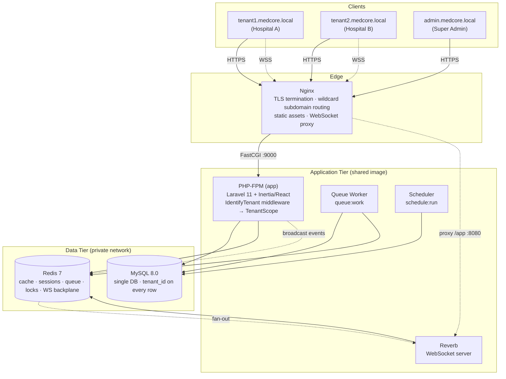
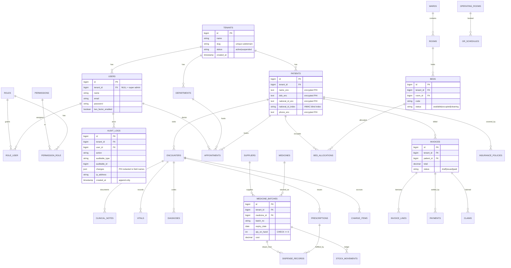
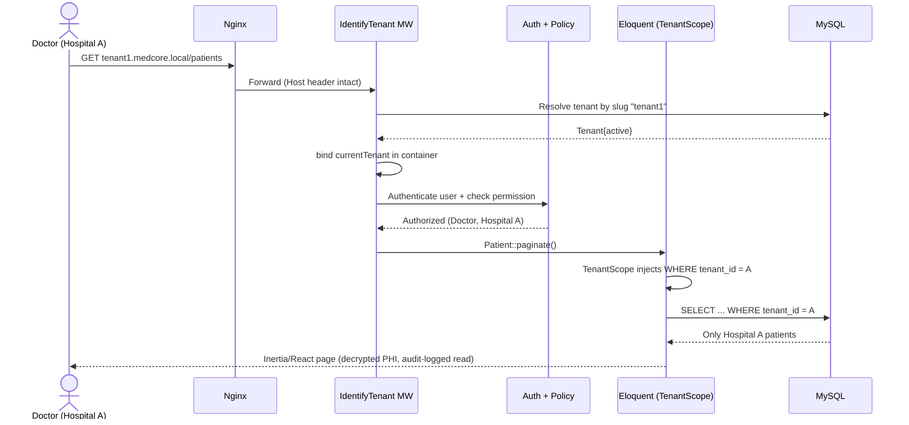

# MedCore — Multi-Tenant Healthcare & Hospital ERP

> Enterprise-grade, multi-tenant Hospital & Healthcare ERP built on a single-database, **row-level tenancy** architecture with strong data isolation, HIPAA-aligned PHI protection, and real-time clinical resource management.

---

## 1. Project Overview

MedCore is a SaaS Hospital ERP that lets a single deployment securely serve many independent hospitals/clinics ("tenants"). Each tenant operates in complete data isolation while sharing one application and one database, keeping infrastructure lean and upgrades uniform.

The platform spans the full hospital workflow: patient registration and electronic medical records (EMR), appointments and clinical documentation, pharmacy with perishable batch/expiry tracking, real-time bed & operating-room management, and financials (billing, payments, insurance claims) with analytics dashboards.

**Core principles**
- **Strong tenant isolation** — enforced at the ORM layer via Laravel Global Scopes so a forgotten `where` clause can never leak data across hospitals.
- **HIPAA-aligned security** — field-level encryption of PHI, blind-index search, immutable audit trail, and PHI access logging.
- **Real-time operations** — live bed/OR boards over self-hosted WebSockets (Laravel Reverb + Redis).
- **Race-free critical paths** — pessimistic locking & atomic updates for bed allocation and medicine stock deduction.
- **Containerized & reproducible** — Docker Compose for dev and a hardened single-host production stack.

---

## 2. Tech Stack

| Layer | Technology |
|---|---|
| **Language / Runtime** | PHP 8.3+ |
| **Framework** | Laravel 11+ |
| **Database** | MySQL 8.0 (single DB, row-level tenancy) |
| **Cache / Queue / Locks / Pub-Sub** | Redis 7 |
| **Real-time** | Laravel Reverb (self-hosted WebSockets) + Laravel Echo |
| **Frontend** | Inertia.js + **React 18** + TypeScript + Tailwind CSS |
| **Build tooling** | Vite |
| **Auth & RBAC** | Laravel session auth + 2FA (TOTP) + `spatie/laravel-permission` (teams mode → tenant-scoped) |
| **Web server / Proxy** | Nginx (TLS termination, wildcard-subdomain routing, WS proxy) |
| **Containerization** | Docker + Docker Compose |
| **Testing / QA** | Pest (PHP), Vitest (TS), PHPStan, Laravel Pint |

---

## 3. System Architecture



---

## 4. Database ER Diagram

> Representative core schema. Every tenant-owned table carries an indexed `tenant_id` FK (omitted from some relations below for readability but present on all clinical/operational tables).



---

## 5. Sequence Diagrams

### 5.1 Tenant-aware authenticated request (isolation guarantee)



### 5.2 Race-free bed allocation

```mermaid
sequenceDiagram
    actor R1 as Receptionist 1
    actor R2 as Receptionist 2
    participant S as BedAllocationService
    participant DB as MySQL
    participant RV as Reverb (WS)

    par Concurrent allocation of same bed
        R1->>S: Allocate Bed #12
    and
        R2->>S: Allocate Bed #12
    end

    S->>DB: BEGIN; SELECT ... FOR UPDATE (Bed #12)
    Note over DB: Row lock — R2's tx waits
    DB-->>S: Bed status = available
    S->>DB: UPDATE status='occupied'; INSERT allocation; COMMIT
    S->>RV: broadcast BedStatusChanged (tenant channel)
    RV-->>R1: Live update → success
    RV-->>R2: Live update → bed now occupied

    S->>DB: (R2 tx resumes) SELECT ... FOR UPDATE
    DB-->>S: Bed status = occupied
    S-->>R2: 409 Conflict — bed already taken
```

---

## 6. Stakeholders

| Stakeholder | Role / Interest |
|---|---|
| **Platform Operator (Super Admin)** | Owns the SaaS; provisions/suspends tenants, manages plans, monitors platform health & security. |
| **Hospital Administrator (Tenant Admin)** | Manages a single hospital: staff, roles, departments, billing config; accountable for compliance. |
| **Doctor / Physician** | Records EMR, writes prescriptions & orders, reviews patient history. |
| **Nurse** | Records vitals, manages admissions/discharges, bed transfers. |
| **Receptionist / Front Desk** | Registers patients, schedules appointments, handles check-in/out and basic billing. |
| **Pharmacist** | Dispenses medication, manages inventory, batches & expiry. |
| **Lab Technician** | (Future module) Processes lab orders and results. |
| **Cashier / Billing Officer** | Generates invoices, records payments, processes insurance claims. |
| **Patient** | Subject of care; owner of the protected PHI the system safeguards. |
| **Compliance / Security Officer** | Audits access logs, oversees HIPAA-aligned controls and retention. |
| **DevOps Engineer** | Owns deployment, scaling, backups, monitoring of the containerized stack. |

---

## 7. Feature List

### Platform & Tenancy
- Multi-tenant SaaS with subdomain-per-tenant routing
- Single-database row-level isolation (Global Scopes + `BelongsToTenant` trait)
- Super Admin tenant provisioning, suspension, and plan management
- Audited tenant impersonation for support

### Security & Compliance (HIPAA-aligned)
- Field-level PHI encryption (AES-256-GCM) with blind-index search
- Tenant-scoped RBAC (Super Admin / Tenant Admin / Doctor / Nurse / Receptionist / Pharmacist / Cashier)
- 2FA (TOTP) for clinical & admin roles
- Immutable, append-only audit trail + PHI read-access logging
- Configurable data retention, soft deletes, encrypted backups, key rotation

### Clinical / EMR (Phase 2)
- Patient registration & searchable demographics
- Appointments & doctor scheduling with conflict detection
- Encounters/visits, clinical notes, vitals, ICD-10 diagnoses
- Record-level access policies per role and department

### Pharmacy & Inventory (Phase 3)
- Medicine catalog with batch/lot & expiry tracking
- FEFO (First-Expiry-First-Out) stock allocation
- Immutable stock-movement ledger; race-free deduction
- Low-stock & near-expiry alerts; supplier & purchase orders
- Prescription-driven dispensing

### Real-Time Resource Management (Phase 4)
- Live bed board (wards/rooms/beds) with status updates over WebSockets
- Operating-room scheduling
- Admit / discharge / transfer flows
- Race-free allocation via pessimistic locking
- Tenant-scoped private/presence channels

### Financials & Analytics (Phase 5)
- Charge capture across EMR, pharmacy, and beds
- Invoicing with queued PDF generation; payments & ledger
- Insurance policies & claims workflow; tax configuration
- Tenant analytics dashboards (revenue, occupancy, dispensing trends) on pre-aggregated data

### Infrastructure & DevOps
- Docker Compose dev environment (Nginx, PHP-FPM, MySQL, Redis, Queue, Scheduler, Reverb, Vite)
- Hardened single-host production compose with TLS
- CI pipeline: Pint, PHPStan, Pest, Vitest, production build
- Tenancy-isolation, encryption, and concurrency test suites

---

## 8. Getting Started (planned)

```bash
# Bring up the full dev stack
docker compose up -d

# App:          http://tenant1.medcore.local
# Super Admin:  http://admin.medcore.local
```

> Full setup, migrations, and seed instructions are defined in the phase-wise implementation plan (`plan.md`). Phase 1 delivers the bootable, tenant-isolated foundation.

---

*See [`plan.md`](plan.md) for the detailed, phase-wise engineering roadmap and architectural decisions.*
